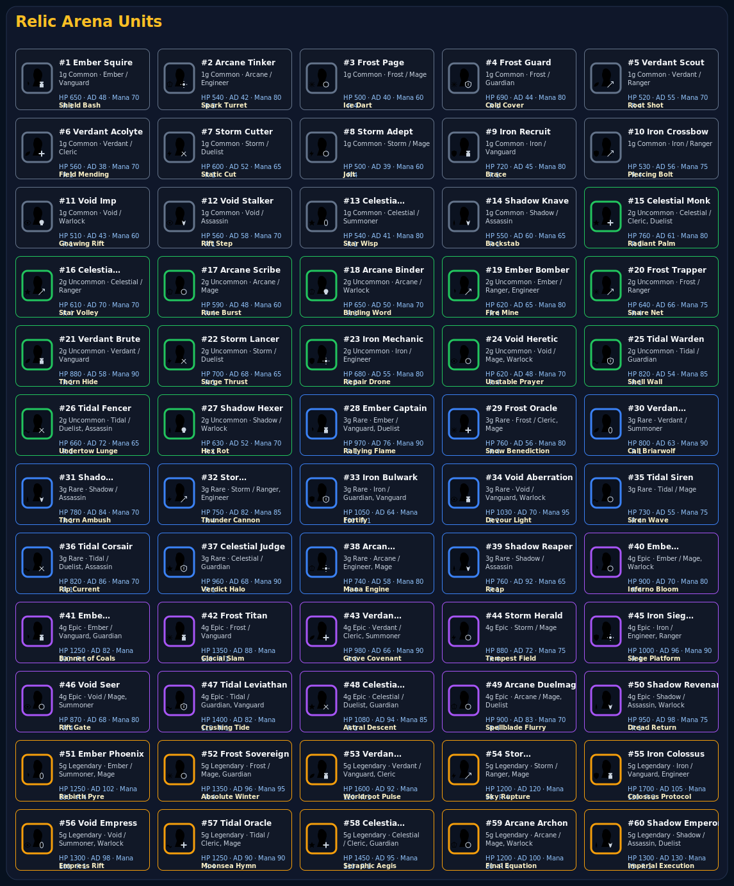
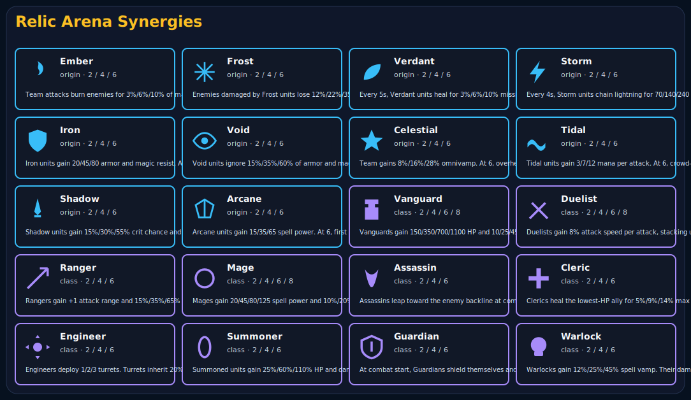
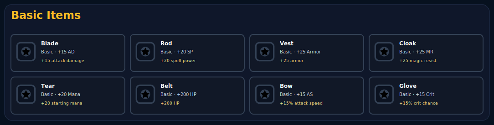
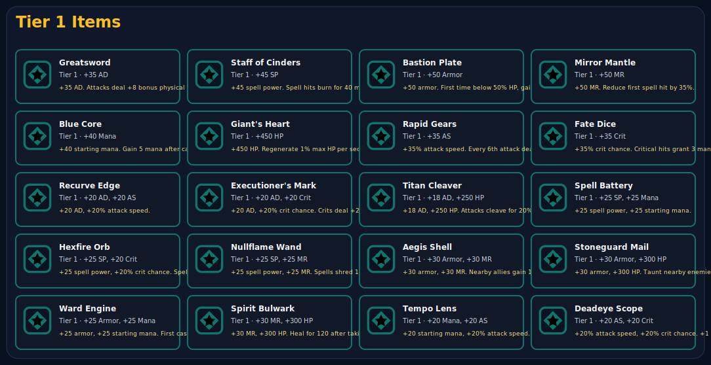
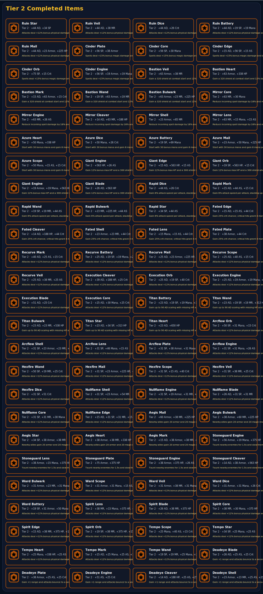

# Relic Arena 데이터 도감

[메인 README](../../README.ko.md) · [패치노트](../../PATCH_NOTES.md) · [온라인 플레이](https://pinehill99.github.io/relic-arena/)

이 문서는 게임 데이터 소스에서 생성한 기물, 시너지, 아이템 도감입니다. SVG 시트는 GitHub README에서 바로 볼 수 있도록 함께 저장합니다.

## 요약

| 항목 | 수량 |
|---|---:|
| 기물 | 60 |
| 기원 시너지 | 10 |
| 직업 시너지 | 10 |
| 기본 아이템 | 8 |
| 1단계 아이템 | 20 |
| 2단계 완성 아이템 | 100 |

## 기물 SVG 시트

| ID | 기물 | 비용 | 기원 | 직업 | HP | AD | Mana | Range | 스킬 |
|---:|---|---:|---|---|---:|---:|---:|---:|---|
| 1 | Ember Squire | 1 | Ember | Vanguard | 650 | 48 | 70 | 1 | Shield Bash: Gain a 160 shield and deal 90 physical damage to current target. |
| 2 | Arcane Tinker | 1 | Arcane | Engineer | 540 | 42 | 80 | 3 | Spark Turret: Places a small turret for 6s that attacks for 22 magic damage. |
| 3 | Frost Page | 1 | Frost | Mage | 500 | 40 | 60 | 4 | Ice Dart: Fires a bolt for 140 magic damage and 20% slow for 2s. |
| 4 | Frost Guard | 1 | Frost | Guardian | 690 | 44 | 80 | 1 | Cold Cover: Shields self and nearest ally for 130. |
| 5 | Verdant Scout | 1 | Verdant | Ranger | 520 | 55 | 70 | 4 | Root Shot: Deals 120 physical damage and roots for 0.7s. |
| 6 | Verdant Acolyte | 1 | Verdant | Cleric | 560 | 38 | 70 | 1 | Field Mending: Heals lowest-HP ally for 160. |
| 7 | Storm Cutter | 1 | Storm | Duelist | 600 | 52 | 65 | 1 | Static Cut: Next 3 attacks gain 35% attack speed and chain 35 magic damage. |
| 8 | Storm Adept | 1 | Storm | Mage | 500 | 39 | 60 | 4 | Jolt: Deals 110 magic damage to target and 55 to two nearby enemies. |
| 9 | Iron Recruit | 1 | Iron | Vanguard | 720 | 45 | 80 | 1 | Brace: Gains 35 armor and 120 shield for 4s. |
| 10 | Iron Crossbow | 1 | Iron | Ranger | 530 | 56 | 75 | 4 | Piercing Bolt: Deals 150 physical damage in a line. |
| 11 | Void Imp | 1 | Void | Warlock | 510 | 43 | 60 | 1 | Gnawing Rift: Applies 120 magic damage over 4s. |
| 12 | Void Stalker | 1 | Void | Assassin | 560 | 58 | 70 | 1 | Rift Step: Jumps behind target and strikes for 165 physical damage. |
| 13 | Celestial Novice | 1 | Celestial | Summoner | 540 | 41 | 80 | 1 | Star Wisp: Summons a wisp with 280 HP for 7s. |
| 14 | Shadow Knave | 1 | Shadow | Assassin | 550 | 60 | 65 | 1 | Backstab: Deals 175 physical damage; crits if target is below 50% HP. |
| 15 | Celestial Monk | 2 | Celestial | Cleric, Duelist | 760 | 61 | 80 | 1 | Radiant Palm: Heals self for 180 and strikes target for 170 magic damage. |
| 16 | Celestial Archer | 2 | Celestial | Ranger | 610 | 70 | 70 | 4 | Star Volley: Fires 4 arrows for 55 physical damage each. |
| 17 | Arcane Scribe | 2 | Arcane | Mage | 590 | 48 | 60 | 4 | Rune Burst: Deals 220 magic damage to the largest enemy cluster. |
| 18 | Arcane Binder | 2 | Arcane | Warlock | 650 | 50 | 70 | 1 | Binding Word: Deals 160 magic damage and reduces target mana by 15. |
| 19 | Ember Bomber | 2 | Ember | Ranger, Engineer | 620 | 65 | 80 | 4 | Fire Mine: Throws a mine that deals 210 magic damage in a small area. |
| 20 | Frost Trapper | 2 | Frost | Ranger | 640 | 66 | 75 | 4 | Snare Net: Deals 150 physical damage and stuns for 1s. |
| 21 | Verdant Brute | 2 | Verdant | Vanguard | 880 | 58 | 90 | 1 | Thorn Hide: Gains 250 shield and reflects 40 damage per hit for 4s. |
| 22 | Storm Lancer | 2 | Storm | Duelist | 700 | 68 | 65 | 1 | Surge Thrust: Dashes to target, dealing 190 physical damage. |
| 23 | Iron Mechanic | 2 | Iron | Engineer | 680 | 55 | 80 | 3 | Repair Drone: Summons a drone that heals allies for 45 per second. |
| 24 | Void Heretic | 2 | Void | Mage, Warlock | 620 | 48 | 70 | 4 | Unstable Prayer: Deals 180 magic damage plus 8% missing HP. |
| 25 | Tidal Warden | 2 | Tidal | Guardian | 820 | 54 | 85 | 1 | Shell Wall: Shields adjacent allies for 220. |
| 26 | Tidal Fencer | 2 | Tidal | Duelist, Assassin | 660 | 72 | 65 | 1 | Undertow Lunge: Strikes twice for 95 physical damage each. |
| 27 | Shadow Hexer | 2 | Shadow | Warlock | 630 | 52 | 70 | 1 | Hex Rot: Applies 210 magic damage over 5s and 25% healing reduction. |
| 28 | Ember Captain | 3 | Ember | Vanguard, Duelist | 970 | 76 | 90 | 1 | Rallying Flame: Grants nearby allies 20% attack speed and deals 240 magic damage. |
| 29 | Frost Oracle | 3 | Frost | Cleric, Mage | 760 | 56 | 80 | 4 | Snow Benediction: Heals 2 allies for 260 and slows nearby enemies. |
| 30 | Verdant Beastmaster | 3 | Verdant | Summoner | 800 | 63 | 90 | 1 | Call Briarwolf: Summons a wolf with 700 HP and cleave attacks. |
| 31 | Shadow Thornblade | 3 | Shadow | Assassin | 780 | 84 | 70 | 1 | Thorn Ambush: Leaps and deals 260 physical damage plus bleed. |
| 32 | Storm Artillerist | 3 | Storm | Ranger, Engineer | 750 | 82 | 85 | 4 | Thunder Cannon: Fires at the farthest enemy for 310 physical damage. |
| 33 | Iron Bulwark | 3 | Iron | Guardian, Vanguard | 1050 | 64 | 100 | 1 | Fortify: Grants team 18 armor and shields self for 420. |
| 34 | Void Aberration | 3 | Void | Vanguard, Warlock | 1030 | 70 | 95 | 1 | Devour Light: Deals 260 magic damage and heals for 60% of damage dealt. |
| 35 | Tidal Siren | 3 | Tidal | Mage | 730 | 55 | 75 | 4 | Siren Wave: Wave hits a row for 270 magic damage and 1s silence. |
| 36 | Tidal Corsair | 3 | Tidal | Duelist, Assassin | 820 | 86 | 70 | 1 | Rip Current: 3 rapid strikes; final hit deals bonus missing-HP damage. |
| 37 | Celestial Judge | 3 | Celestial | Guardian | 960 | 68 | 90 | 1 | Verdict Halo: Shields allies in a circle and deals 180 magic damage to enemies. |
| 38 | Arcane Machinist | 3 | Arcane | Engineer, Mage | 740 | 58 | 80 | 4 | Mana Engine: Empowers turrets and deals 240 magic damage to a cluster. |
| 39 | Shadow Reaper | 3 | Shadow | Assassin | 760 | 92 | 65 | 1 | Reap: Executes low-HP target or deals 300 physical damage. |
| 40 | Ember Pyromancer | 4 | Ember | Mage, Warlock | 900 | 70 | 80 | 4 | Inferno Bloom: Large area takes 480 magic damage over 4s. |
| 41 | Ember Legionnaire | 4 | Ember | Vanguard, Guardian | 1250 | 82 | 100 | 1 | Banner of Coals: Shields team for 300 and taunts nearby enemies. |
| 42 | Frost Titan | 4 | Frost | Vanguard | 1350 | 88 | 110 | 1 | Glacial Slam: Deals 360 magic damage in a cone and stuns for 1.5s. |
| 43 | Verdant Hierophant | 4 | Verdant | Cleric, Summoner | 980 | 66 | 90 | 1 | Grove Covenant: Summons two saplings and heals all allies for 220. |
| 44 | Storm Herald | 4 | Storm | Mage | 880 | 72 | 75 | 4 | Tempest Field: Deals 420 magic damage split among 5 bolts. |
| 45 | Iron Siege Master | 4 | Iron | Engineer, Ranger | 1000 | 96 | 90 | 4 | Siege Platform: Deploys a cannon that shells clusters for 160 physical damage. |
| 46 | Void Seer | 4 | Void | Mage, Summoner | 870 | 68 | 80 | 4 | Rift Gate: Summons a voidling and blasts 3 enemies for 260 magic damage. |
| 47 | Tidal Leviathan | 4 | Tidal | Guardian, Vanguard | 1400 | 82 | 115 | 1 | Crushing Tide: Knocks up nearby enemies and gains 500 shield. |
| 48 | Celestial Valkyrie | 4 | Celestial | Duelist, Guardian | 1080 | 94 | 85 | 1 | Astral Descent: Dives to lowest-HP enemy for 420 physical damage and shields self. |
| 49 | Arcane Duelmage | 4 | Arcane | Mage, Duelist | 900 | 83 | 70 | 4 | Spellblade Flurry: 5 magic slashes for 115 damage each. |
| 50 | Shadow Revenant | 4 | Shadow | Assassin, Warlock | 950 | 98 | 75 | 1 | Dread Return: Becomes untargetable, strikes for 460 physical damage, then heals. |
| 51 | Ember Phoenix | 5 | Ember | Summoner, Mage | 1250 | 102 | 100 | 4 | Rebirth Pyre: Massive area burn for 700 magic damage; once per fight revives at 45% HP. |
| 52 | Frost Sovereign | 5 | Frost | Mage, Guardian | 1350 | 96 | 95 | 4 | Absolute Winter: Freezes all enemies for 1s and deals 520 magic damage. |
| 53 | Verdant Worldroot | 5 | Verdant | Vanguard, Cleric | 1600 | 92 | 120 | 1 | Worldroot Pulse: Heals all allies for 420 and roots enemies for 1.5s. |
| 54 | Storm Dragonling | 5 | Storm | Ranger, Mage | 1200 | 120 | 90 | 4 | Sky Rupture: Lightning line deals 650 mixed damage and chains twice. |
| 55 | Iron Colossus | 5 | Iron | Vanguard, Engineer | 1700 | 105 | 130 | 3 | Colossus Protocol: Gains 900 shield and deploys two rail turrets. |
| 56 | Void Empress | 5 | Void | Summoner, Warlock | 1300 | 98 | 100 | 1 | Empress Rift: Summons two void guards and drains 300 HP from 4 enemies. |
| 57 | Tidal Oracle | 5 | Tidal | Cleric, Mage | 1250 | 90 | 90 | 4 | Moonsea Hymn: Heals allies for 350 and deals 480 magic damage to enemies in waves. |
| 58 | Celestial Seraph | 5 | Celestial | Cleric, Guardian | 1450 | 95 | 110 | 1 | Seraphic Aegis: Grants all allies 600 shield and 20% damage reduction for 4s. |
| 59 | Arcane Archon | 5 | Arcane | Mage, Warlock | 1200 | 100 | 80 | 4 | Final Equation: Deals 800 magic damage split across the enemy team, prioritizing carries. |
| 60 | Shadow Emperor | 5 | Shadow | Assassin, Duelist | 1300 | 130 | 75 | 1 | Imperial Execution: Teleports to lowest-HP enemy and deals 900 physical damage; resets on kill. |

## 시너지 SVG 시트

### 기원

| 기원 | 활성 기준 | 효과 |
|---|---|---|
| Ember | 2 / 4 / 6 | Team attacks burn enemies for 3%/6%/10% of max HP over 4s. At 6, burn can spread once to a nearby enemy. |
| Frost | 2 / 4 / 6 | Enemies damaged by Frost units lose 12%/22%/35% attack speed for 3s. At 6, each Frost unit's first spell freezes for 1s. |
| Verdant | 2 / 4 / 6 | Every 5s, Verdant units heal for 3%/6%/10% missing HP. At 6, they also gain 12% max HP. |
| Storm | 2 / 4 / 6 | Every 4s, Storm units chain lightning for 70/140/240 magic damage. At 6, gain 15% attack speed. |
| Iron | 2 / 4 / 6 | Iron units gain 20/45/80 armor and magic resist. At 6, reflect 8% post-mitigation damage. |
| Void | 2 / 4 / 6 | Void units ignore 15%/35%/60% of armor and magic resist. At 6, first spell also drains 20 mana. |
| Celestial | 2 / 4 / 6 | Team gains 8%/16%/28% omnivamp. At 6, overhealing becomes a shield up to 20% max HP. |
| Tidal | 2 / 4 / 6 | Tidal units gain 3/7/12 mana per attack. At 6, crowd-control duration from Tidal units increases by 20%. |
| Shadow | 2 / 4 / 6 | Shadow units gain 15%/30%/55% crit chance and execute enemies below 10%/16%/25% HP. |
| Arcane | 2 / 4 / 6 | Arcane units gain 15/35/65 spell power. At 6, first spell is repeated at 40% power. |

### 직업

| 직업 | 활성 기준 | 효과 |
|---|---|---|
| Vanguard | 2 / 4 / 6 / 8 | Vanguards gain 150/350/700/1100 HP and 10/25/45/70 armor. |
| Duelist | 2 / 4 / 6 / 8 | Duelists gain 8% attack speed per attack, stacking up to 4/6/8/10 times. |
| Ranger | 2 / 4 / 6 | Rangers gain +1 attack range and 15%/35%/65% attack damage every 5s for 3s. |
| Mage | 2 / 4 / 6 / 8 | Mages gain 20/45/80/125 spell power and 10%/20%/35%/50% chance to echo a spell at 35% power. |
| Assassin | 2 / 4 / 6 | Assassins leap toward the enemy backline at combat start and gain 20%/40%/75% crit damage. |
| Cleric | 2 / 4 / 6 | Clerics heal the lowest-HP ally for 5%/9%/14% max HP every 6s. |
| Engineer | 2 / 4 / 6 | Engineers deploy 1/2/3 turrets. Turrets inherit 20%/30%/45% of average allied AD. |
| Summoner | 2 / 4 / 6 | Summoned units gain 25%/60%/110% HP and damage. |
| Guardian | 2 / 4 / 6 | At combat start, Guardians shield themselves and adjacent allies for 180/420/800. |
| Warlock | 2 / 4 / 6 | Warlocks gain 12%/25%/45% spell vamp. Their damage-over-time effects tick 1 extra time at 6. |

## 아이템 SVG 시트

### 기본 아이템

| ID | 아이템 | 단계 | 능력치 | 조합식 | 효과 |
|---|---|---|---|---|---|
| B1 | Blade | Basic | +15 AD | - | +15 attack damage |
| B2 | Rod | Basic | +20 SP | - | +20 spell power |
| B3 | Vest | Basic | +25 Armor | - | +25 armor |
| B4 | Cloak | Basic | +25 MR | - | +25 magic resist |
| B5 | Tear | Basic | +20 Mana | - | +20 starting mana |
| B6 | Belt | Basic | +200 HP | - | +200 HP |
| B7 | Bow | Basic | +15 AS | - | +15% attack speed |
| B8 | Glove | Basic | +15 Crit | - | +15% crit chance |

### 1단계 아이템

| ID | 아이템 | 단계 | 능력치 | 조합식 | 효과 |
|---|---|---|---|---|---|
| T1-01 | Greatsword | Tier 1 | +35 AD | Blade + Blade | +35 AD. Attacks deal +8 bonus physical damage. |
| T1-02 | Staff of Cinders | Tier 1 | +45 SP | Rod + Rod | +45 spell power. Spell hits burn for 40 magic damage over 3s. |
| T1-03 | Bastion Plate | Tier 1 | +50 Armor | Vest + Vest | +50 armor. First time below 50% HP, gain 250 shield. |
| T1-04 | Mirror Mantle | Tier 1 | +50 MR | Cloak + Cloak | +50 MR. Reduce first spell hit by 35%. |
| T1-05 | Blue Core | Tier 1 | +40 Mana | Tear + Tear | +40 starting mana. Gain 5 mana after casting. |
| T1-06 | Giant's Heart | Tier 1 | +450 HP | Belt + Belt | +450 HP. Regenerate 1% max HP per second. |
| T1-07 | Rapid Gears | Tier 1 | +35 AS | Bow + Bow | +35% attack speed. Every 6th attack deals +60 magic damage. |
| T1-08 | Fate Dice | Tier 1 | +35 Crit | Glove + Glove | +35% crit chance. Critical hits grant 3 mana. |
| T1-09 | Recurve Edge | Tier 1 | +20 AD, +20 AS | Blade + Bow | +20 AD, +20% attack speed. |
| T1-10 | Executioner's Mark | Tier 1 | +20 AD, +20 Crit | Blade + Glove | +20 AD, +20% crit chance. Crits deal +20% damage. |
| T1-11 | Titan Cleaver | Tier 1 | +18 AD, +250 HP | Blade + Belt | +18 AD, +250 HP. Attacks cleave for 20% damage. |
| T1-12 | Spell Battery | Tier 1 | +25 SP, +25 Mana | Rod + Tear | +25 spell power, +25 starting mana. |
| T1-13 | Hexfire Orb | Tier 1 | +25 SP, +20 Crit | Rod + Glove | +25 spell power, +20% crit chance. Spells can crit. |
| T1-14 | Nullflame Wand | Tier 1 | +25 SP, +25 MR | Rod + Cloak | +25 spell power, +25 MR. Spells shred 10 MR for 4s. |
| T1-15 | Aegis Shell | Tier 1 | +30 Armor, +30 MR | Vest + Cloak | +30 armor, +30 MR. Nearby allies gain 10 armor/MR. |
| T1-16 | Stoneguard Mail | Tier 1 | +30 Armor, +300 HP | Vest + Belt | +30 armor, +300 HP. Taunt nearby enemies for 1s at combat start. |
| T1-17 | Ward Engine | Tier 1 | +25 Armor, +25 Mana | Vest + Tear | +25 armor, +25 starting mana. First cast grants 220 shield. |
| T1-18 | Spirit Bulwark | Tier 1 | +30 MR, +300 HP | Cloak + Belt | +30 MR, +300 HP. Heal for 120 after taking spell damage. |
| T1-19 | Tempo Lens | Tier 1 | +20 Mana, +20 AS | Tear + Bow | +20 starting mana, +20% attack speed. Attacks grant +1 extra mana. |
| T1-20 | Deadeye Scope | Tier 1 | +20 AS, +20 Crit | Bow + Glove | +20% attack speed, +20% crit chance. +1 range if ranged. |

### 2단계 완성 아이템

2단계 완성 아이템 100개 전체 목록

| ID | 아이템 | 단계 | 능력치 | 조합식 | 효과 |
|---|---|---|---|---|---|
| T2-T1-01-T1-02 | Ruin Star | Tier 2 | +44 AD, +34 SP | Greatsword + Staff of Cinders | Attacks deal +12% bonus physical damage and execute enemies below 12% HP. Also: spells deal +15% bonus magic damage and burn the area for 60 magic damage over 3s. |
| T2-T1-01-T1-04 | Ruin Veil | Tier 2 | +44 AD, +38 MR | Greatsword + Mirror Mantle | Attacks deal +12% bonus physical damage and execute enemies below 12% HP. Also: reduce incoming spell damage by 18% and reflect 60 magic damage on spell hit. |
| T2-T1-01-T1-08 | Ruin Dice | Tier 2 | +44 AD, +26 Crit | Greatsword + Fate Dice | Attacks deal +12% bonus physical damage and execute enemies below 12% HP. Also: gain 25% crit chance; critical hits grant 4 mana. |
| T2-T1-01-T1-12 | Ruin Battery | Tier 2 | +44 AD, +19 SP, +19 Mana | Greatsword + Spell Battery | Attacks deal +12% bonus physical damage and execute enemies below 12% HP. |
| T2-T1-01-T1-16 | Ruin Mail | Tier 2 | +44 AD, +23 Armor, +225 HP | Greatsword + Stoneguard Mail | Attacks deal +12% bonus physical damage and execute enemies below 12% HP. Also: taunt nearby enemies for 1. |
| T2-T1-02-T1-03 | Cinder Plate | Tier 2 | +56 SP, +38 Armor | Staff of Cinders + Bastion Plate | Spells deal +15% bonus magic damage and burn the area for 60 magic damage over 3s. Also: gain a 320 shield at combat start and 12% damage reduction while shielded. |
| T2-T1-02-T1-05 | Cinder Core | Tier 2 | +56 SP, +30 Mana | Staff of Cinders + Blue Core | Spells deal +15% bonus magic damage and burn the area for 60 magic damage over 3s. Also: start with 30 bonus mana and gain 8 mana per cast. |
| T2-T1-02-T1-09 | Cinder Edge | Tier 2 | +15 AD, +56 SP, +15 AS | Staff of Cinders + Recurve Edge | Spells deal +15% bonus magic damage and burn the area for 60 magic damage over 3s. |
| T2-T1-02-T1-13 | Cinder Orb | Tier 2 | +75 SP, +15 Crit | Staff of Cinders + Hexfire Orb | Spells deal +15% bonus magic damage and burn the area for 60 magic damage over 3s. |
| T2-T1-02-T1-17 | Cinder Engine | Tier 2 | +56 SP, +19 Armor, +19 Mana | Staff of Cinders + Ward Engine | Spells deal +15% bonus magic damage and burn the area for 60 magic damage over 3s. |
| T2-T1-03-T1-04 | Bastion Veil | Tier 2 | +63 Armor, +38 MR | Bastion Plate + Mirror Mantle | Gain a 320 shield at combat start and 12% damage reduction while shielded. Also: reduce incoming spell damage by 18% and reflect 60 magic damage on spell hit. |
| T2-T1-03-T1-06 | Bastion Heart | Tier 2 | +63 Armor, +338 HP | Bastion Plate + Giant's Heart | Gain a 320 shield at combat start and 12% damage reduction while shielded. Also: gain 12% bonus max hp and a 300 shield when first below 50% hp. |
| T2-T1-03-T1-10 | Bastion Mark | Tier 2 | +15 AD, +63 Armor, +15 Crit | Bastion Plate + Executioner's Mark | Gain a 320 shield at combat start and 12% damage reduction while shielded. |
| T2-T1-03-T1-14 | Bastion Wand | Tier 2 | +19 SP, +63 Armor, +19 MR | Bastion Plate + Nullflame Wand | Gain a 320 shield at combat start and 12% damage reduction while shielded. |
| T2-T1-03-T1-18 | Bastion Bulwark | Tier 2 | +63 Armor, +23 MR, +225 HP | Bastion Plate + Spirit Bulwark | Gain a 320 shield at combat start and 12% damage reduction while shielded. |
| T2-T1-04-T1-05 | Mirror Core | Tier 2 | +63 MR, +30 Mana | Mirror Mantle + Blue Core | Reduce incoming spell damage by 18% and reflect 60 magic damage on spell hit. Also: start with 30 bonus mana and gain 8 mana per cast. |
| T2-T1-04-T1-07 | Mirror Engine | Tier 2 | +63 MR, +26 AS | Mirror Mantle + Rapid Gears | Reduce incoming spell damage by 18% and reflect 60 magic damage on spell hit. Also: gain 6% attack speed per attack, stacking up to 10 times. |
| T2-T1-04-T1-11 | Mirror Cleaver | Tier 2 | +14 AD, +63 MR, +188 HP | Mirror Mantle + Titan Cleaver | Reduce incoming spell damage by 18% and reflect 60 magic damage on spell hit. Also: gain up to 90 ad scaling with missing hp and heal 8% of damage dealt. |
| T2-T1-04-T1-15 | Mirror Shell | Tier 2 | +23 Armor, +85 MR | Mirror Mantle + Aegis Shell | Reduce incoming spell damage by 18% and reflect 60 magic damage on spell hit. Also: nearby allies gain 20 armor and 20 magic resist. |
| T2-T1-04-T1-19 | Mirror Lens | Tier 2 | +63 MR, +15 Mana, +15 AS | Mirror Mantle + Tempo Lens | Reduce incoming spell damage by 18% and reflect 60 magic damage on spell hit. |
| T2-T1-05-T1-06 | Azure Heart | Tier 2 | +50 Mana, +338 HP | Blue Core + Giant's Heart | Start with 30 bonus mana and gain 8 mana per cast. Also: gain 12% bonus max hp and a 300 shield when first below 50% hp. |
| T2-T1-05-T1-08 | Azure Dice | Tier 2 | +50 Mana, +26 Crit | Blue Core + Fate Dice | Start with 30 bonus mana and gain 8 mana per cast. Also: gain 25% crit chance; critical hits grant 4 mana. |
| T2-T1-05-T1-12 | Azure Battery | Tier 2 | +19 SP, +69 Mana | Blue Core + Spell Battery | Start with 30 bonus mana and gain 8 mana per cast. |
| T2-T1-05-T1-16 | Azure Mail | Tier 2 | +23 Armor, +50 Mana, +225 HP | Blue Core + Stoneguard Mail | Start with 30 bonus mana and gain 8 mana per cast. Also: taunt nearby enemies for 1. |
| T2-T1-05-T1-20 | Azure Scope | Tier 2 | +50 Mana, +15 AS, +15 Crit | Blue Core + Deadeye Scope | Start with 30 bonus mana and gain 8 mana per cast. Also: gain +1 range and attacks bounce to a second target for 40% damage. |
| T2-T1-06-T1-07 | Giant Engine | Tier 2 | +563 HP, +26 AS | Giant's Heart + Rapid Gears | Gain 12% bonus max HP and a 300 shield when first below 50% HP. Also: gain 6% attack speed per attack, stacking up to 10 times. |
| T2-T1-06-T1-09 | Giant Edge | Tier 2 | +15 AD, +563 HP, +15 AS | Giant's Heart + Recurve Edge | Gain 12% bonus max HP and a 300 shield when first below 50% HP. |
| T2-T1-06-T1-13 | Giant Orb | Tier 2 | +19 SP, +563 HP, +15 Crit | Giant's Heart + Hexfire Orb | Gain 12% bonus max HP and a 300 shield when first below 50% HP. |
| T2-T1-06-T1-17 | Giant Engine | Tier 2 | +19 Armor, +19 Mana, +563 HP | Giant's Heart + Ward Engine | Gain 12% bonus max HP and a 300 shield when first below 50% HP. |
| T2-T1-06-T1-01 | Giant Blade | Tier 2 | +26 AD, +563 HP | Giant's Heart + Greatsword | Gain 12% bonus max HP and a 300 shield when first below 50% HP. Also: attacks deal +12% bonus physical damage and execute enemies below 12% hp. |
| T2-T1-07-T1-08 | Rapid Dice | Tier 2 | +44 AS, +26 Crit | Rapid Gears + Fate Dice | Gain 6% attack speed per attack, stacking up to 10 times. Also: gain 25% crit chance; critical hits grant 4 mana. |
| T2-T1-07-T1-10 | Rapid Mark | Tier 2 | +15 AD, +44 AS, +15 Crit | Rapid Gears + Executioner's Mark | Gain 6% attack speed per attack, stacking up to 10 times. |
| T2-T1-07-T1-14 | Rapid Wand | Tier 2 | +19 SP, +19 MR, +44 AS | Rapid Gears + Nullflame Wand | Gain 6% attack speed per attack, stacking up to 10 times. |
| T2-T1-07-T1-18 | Rapid Bulwark | Tier 2 | +23 MR, +225 HP, +44 AS | Rapid Gears + Spirit Bulwark | Gain 6% attack speed per attack, stacking up to 10 times. |
| T2-T1-07-T1-02 | Rapid Star | Tier 2 | +34 SP, +44 AS | Rapid Gears + Staff of Cinders | Gain 6% attack speed per attack, stacking up to 10 times. Also: spells deal +15% bonus magic damage and burn the area for 60 magic damage over 3s. |
| T2-T1-08-T1-09 | Fated Edge | Tier 2 | +15 AD, +15 AS, +44 Crit | Fate Dice + Recurve Edge | Gain 25% crit chance; critical hits grant 4 mana. |
| T2-T1-08-T1-11 | Fated Cleaver | Tier 2 | +14 AD, +188 HP, +44 Crit | Fate Dice + Titan Cleaver | Gain 25% crit chance; critical hits grant 4 mana. Also: gain up to 90 ad scaling with missing hp and heal 8% of damage dealt. |
| T2-T1-08-T1-15 | Fated Shell | Tier 2 | +23 Armor, +23 MR, +44 Crit | Fate Dice + Aegis Shell | Gain 25% crit chance; critical hits grant 4 mana. Also: nearby allies gain 20 armor and 20 magic resist. |
| T2-T1-08-T1-19 | Fated Lens | Tier 2 | +15 Mana, +15 AS, +44 Crit | Fate Dice + Tempo Lens | Gain 25% crit chance; critical hits grant 4 mana. |
| T2-T1-08-T1-03 | Fated Plate | Tier 2 | +38 Armor, +44 Crit | Fate Dice + Bastion Plate | Gain 25% crit chance; critical hits grant 4 mana. Also: gain a 320 shield at combat start and 12% damage reduction while shielded. |
| T2-T1-09-T1-10 | Recurve Mark | Tier 2 | +40 AD, +25 AS, +15 Crit | Recurve Edge + Executioner's Mark | Attacks deal +12% bonus physical damage and execute enemies below 12% HP. |
| T2-T1-09-T1-12 | Recurve Battery | Tier 2 | +25 AD, +19 SP, +19 Mana, +25 AS | Recurve Edge + Spell Battery | Attacks deal +12% bonus physical damage and execute enemies below 12% HP. |
| T2-T1-09-T1-16 | Recurve Mail | Tier 2 | +25 AD, +23 Armor, +225 HP, +25 AS | Recurve Edge + Stoneguard Mail | Attacks deal +12% bonus physical damage and execute enemies below 12% HP. Also: taunt nearby enemies for 1. |
| T2-T1-09-T1-20 | Recurve Scope | Tier 2 | +25 AD, +40 AS, +15 Crit | Recurve Edge + Deadeye Scope | Attacks deal +12% bonus physical damage and execute enemies below 12% HP. Also: gain +1 range and attacks bounce to a second target for 40% damage. |
| T2-T1-09-T1-04 | Recurve Veil | Tier 2 | +25 AD, +38 MR, +25 AS | Recurve Edge + Mirror Mantle | Attacks deal +12% bonus physical damage and execute enemies below 12% HP. Also: reduce incoming spell damage by 18% and reflect 60 magic damage on spell hit. |
| T2-T1-10-T1-11 | Execution Cleaver | Tier 2 | +39 AD, +188 HP, +25 Crit | Executioner's Mark + Titan Cleaver | Attacks deal +12% bonus physical damage and execute enemies below 12% HP. Also: gain up to 90 ad scaling with missing hp and heal 8% of damage dealt. |
| T2-T1-10-T1-13 | Execution Orb | Tier 2 | +25 AD, +19 SP, +40 Crit | Executioner's Mark + Hexfire Orb | Attacks deal +12% bonus physical damage and execute enemies below 12% HP. |
| T2-T1-10-T1-17 | Execution Engine | Tier 2 | +25 AD, +19 Armor, +19 Mana, +25 Crit | Executioner's Mark + Ward Engine | Attacks deal +12% bonus physical damage and execute enemies below 12% HP. |
| T2-T1-10-T1-01 | Execution Blade | Tier 2 | +51 AD, +25 Crit | Executioner's Mark + Greatsword | Attacks deal +12% bonus physical damage and execute enemies below 12% HP. Also: attacks deal +12% bonus physical damage and execute enemies below 12% hp. |
| T2-T1-10-T1-05 | Execution Core | Tier 2 | +25 AD, +30 Mana, +25 Crit | Executioner's Mark + Blue Core | Attacks deal +12% bonus physical damage and execute enemies below 12% HP. Also: start with 30 bonus mana and gain 8 mana per cast. |
| T2-T1-11-T1-12 | Titan Battery | Tier 2 | +23 AD, +19 SP, +19 Mana, +313 HP | Titan Cleaver + Spell Battery | Gain up to 90 AD scaling with missing HP and heal 8% of damage dealt. |
| T2-T1-11-T1-14 | Titan Wand | Tier 2 | +23 AD, +19 SP, +19 MR, +313 HP | Titan Cleaver + Nullflame Wand | Gain up to 90 AD scaling with missing HP and heal 8% of damage dealt. |
| T2-T1-11-T1-18 | Titan Bulwark | Tier 2 | +23 AD, +23 MR, +538 HP | Titan Cleaver + Spirit Bulwark | Gain up to 90 AD scaling with missing HP and heal 8% of damage dealt. |
| T2-T1-11-T1-02 | Titan Star | Tier 2 | +23 AD, +34 SP, +313 HP | Titan Cleaver + Staff of Cinders | Gain up to 90 AD scaling with missing HP and heal 8% of damage dealt. Also: spells deal +15% bonus magic damage and burn the area for 60 magic damage over 3s. |
| T2-T1-11-T1-06 | Titan Heart | Tier 2 | +23 AD, +650 HP | Titan Cleaver + Giant's Heart | Gain up to 90 AD scaling with missing HP and heal 8% of damage dealt. Also: gain 12% bonus max hp and a 300 shield when first below 50% hp. |
| T2-T1-12-T1-13 | Arcflow Orb | Tier 2 | +50 SP, +31 Mana, +15 Crit | Spell Battery + Hexfire Orb | Attacks deal +12% bonus physical damage and execute enemies below 12% HP. |
| T2-T1-12-T1-15 | Arcflow Shell | Tier 2 | +31 SP, +23 Armor, +23 MR, +31 Mana | Spell Battery + Aegis Shell | Attacks deal +12% bonus physical damage and execute enemies below 12% HP. Also: nearby allies gain 20 armor and 20 magic resist. |
| T2-T1-12-T1-19 | Arcflow Lens | Tier 2 | +31 SP, +46 Mana, +15 AS | Spell Battery + Tempo Lens | Attacks deal +12% bonus physical damage and execute enemies below 12% HP. |
| T2-T1-12-T1-03 | Arcflow Plate | Tier 2 | +31 SP, +38 Armor, +31 Mana | Spell Battery + Bastion Plate | Attacks deal +12% bonus physical damage and execute enemies below 12% HP. Also: gain a 320 shield at combat start and 12% damage reduction while shielded. |
| T2-T1-12-T1-07 | Arcflow Engine | Tier 2 | +31 SP, +31 Mana, +26 AS | Spell Battery + Rapid Gears | Attacks deal +12% bonus physical damage and execute enemies below 12% HP. Also: gain 6% attack speed per attack, stacking up to 10 times. |
| T2-T1-13-T1-14 | Hexfire Wand | Tier 2 | +50 SP, +19 MR, +25 Crit | Hexfire Orb + Nullflame Wand | Attacks deal +12% bonus physical damage and execute enemies below 12% HP. |
| T2-T1-13-T1-16 | Hexfire Mail | Tier 2 | +31 SP, +23 Armor, +225 HP, +25 Crit | Hexfire Orb + Stoneguard Mail | Attacks deal +12% bonus physical damage and execute enemies below 12% HP. Also: taunt nearby enemies for 1. |
| T2-T1-13-T1-20 | Hexfire Scope | Tier 2 | +31 SP, +15 AS, +40 Crit | Hexfire Orb + Deadeye Scope | Attacks deal +12% bonus physical damage and execute enemies below 12% HP. Also: gain +1 range and attacks bounce to a second target for 40% damage. |
| T2-T1-13-T1-04 | Hexfire Veil | Tier 2 | +31 SP, +38 MR, +25 Crit | Hexfire Orb + Mirror Mantle | Attacks deal +12% bonus physical damage and execute enemies below 12% HP. Also: reduce incoming spell damage by 18% and reflect 60 magic damage on spell hit. |
| T2-T1-13-T1-08 | Hexfire Dice | Tier 2 | +31 SP, +51 Crit | Hexfire Orb + Fate Dice | Attacks deal +12% bonus physical damage and execute enemies below 12% HP. Also: gain 25% crit chance; critical hits grant 4 mana. |
| T2-T1-14-T1-15 | Nullflame Shell | Tier 2 | +31 SP, +23 Armor, +54 MR | Nullflame Wand + Aegis Shell | Attacks deal +12% bonus physical damage and execute enemies below 12% HP. Also: nearby allies gain 20 armor and 20 magic resist. |
| T2-T1-14-T1-17 | Nullflame Engine | Tier 2 | +31 SP, +19 Armor, +31 MR, +19 Mana | Nullflame Wand + Ward Engine | Attacks deal +12% bonus physical damage and execute enemies below 12% HP. |
| T2-T1-14-T1-01 | Nullflame Blade | Tier 2 | +26 AD, +31 SP, +31 MR | Nullflame Wand + Greatsword | Attacks deal +12% bonus physical damage and execute enemies below 12% HP. Also: attacks deal +12% bonus physical damage and execute enemies below 12% hp. |
| T2-T1-14-T1-05 | Nullflame Core | Tier 2 | +31 SP, +31 MR, +30 Mana | Nullflame Wand + Blue Core | Attacks deal +12% bonus physical damage and execute enemies below 12% HP. Also: start with 30 bonus mana and gain 8 mana per cast. |
| T2-T1-14-T1-09 | Nullflame Edge | Tier 2 | +15 AD, +31 SP, +31 MR, +15 AS | Nullflame Wand + Recurve Edge | Attacks deal +12% bonus physical damage and execute enemies below 12% HP. |
| T2-T1-15-T1-16 | Aegis Mail | Tier 2 | +60 Armor, +38 MR, +225 HP | Aegis Shell + Stoneguard Mail | Nearby allies gain 20 armor and 20 magic resist. Also: taunt nearby enemies for 1. |
| T2-T1-15-T1-18 | Aegis Bulwark | Tier 2 | +38 Armor, +60 MR, +225 HP | Aegis Shell + Spirit Bulwark | Nearby allies gain 20 armor and 20 magic resist. |
| T2-T1-15-T1-02 | Aegis Star | Tier 2 | +34 SP, +38 Armor, +38 MR | Aegis Shell + Staff of Cinders | Nearby allies gain 20 armor and 20 magic resist. Also: spells deal +15% bonus magic damage and burn the area for 60 magic damage over 3s. |
| T2-T1-15-T1-06 | Aegis Heart | Tier 2 | +38 Armor, +38 MR, +338 HP | Aegis Shell + Giant's Heart | Nearby allies gain 20 armor and 20 magic resist. Also: gain 12% bonus max hp and a 300 shield when first below 50% hp. |
| T2-T1-15-T1-10 | Aegis Mark | Tier 2 | +15 AD, +38 Armor, +38 MR, +15 Crit | Aegis Shell + Executioner's Mark | Nearby allies gain 20 armor and 20 magic resist. |
| T2-T1-16-T1-17 | Stoneguard Engine | Tier 2 | +56 Armor, +19 Mana, +375 HP | Stoneguard Mail + Ward Engine | Taunt nearby enemies for 1.5s and slow them by 25% at combat start. |
| T2-T1-16-T1-19 | Stoneguard Lens | Tier 2 | +38 Armor, +15 Mana, +375 HP, +15 AS | Stoneguard Mail + Tempo Lens | Taunt nearby enemies for 1.5s and slow them by 25% at combat start. |
| T2-T1-16-T1-03 | Stoneguard Plate | Tier 2 | +75 Armor, +375 HP | Stoneguard Mail + Bastion Plate | Taunt nearby enemies for 1.5s and slow them by 25% at combat start. Also: gain a 320 shield at combat start and 12% damage reduction while shielded. |
| T2-T1-16-T1-07 | Stoneguard Engine | Tier 2 | +38 Armor, +375 HP, +26 AS | Stoneguard Mail + Rapid Gears | Taunt nearby enemies for 1.5s and slow them by 25% at combat start. Also: gain 6% attack speed per attack, stacking up to 10 times. |
| T2-T1-16-T1-11 | Stoneguard Cleaver | Tier 2 | +14 AD, +38 Armor, +563 HP | Stoneguard Mail + Titan Cleaver | Taunt nearby enemies for 1.5s and slow them by 25% at combat start. Also: gain up to 90 ad scaling with missing hp and heal 8% of damage dealt. |
| T2-T1-17-T1-18 | Ward Bulwark | Tier 2 | +31 Armor, +23 MR, +31 Mana, +225 HP | Ward Engine + Spirit Bulwark | Attacks deal +12% bonus physical damage and execute enemies below 12% HP. |
| T2-T1-17-T1-20 | Ward Scope | Tier 2 | +31 Armor, +31 Mana, +15 AS, +15 Crit | Ward Engine + Deadeye Scope | Attacks deal +12% bonus physical damage and execute enemies below 12% HP. Also: gain +1 range and attacks bounce to a second target for 40% damage. |
| T2-T1-17-T1-04 | Ward Veil | Tier 2 | +31 Armor, +38 MR, +31 Mana | Ward Engine + Mirror Mantle | Attacks deal +12% bonus physical damage and execute enemies below 12% HP. Also: reduce incoming spell damage by 18% and reflect 60 magic damage on spell hit. |
| T2-T1-17-T1-08 | Ward Dice | Tier 2 | +31 Armor, +31 Mana, +26 Crit | Ward Engine + Fate Dice | Attacks deal +12% bonus physical damage and execute enemies below 12% HP. Also: gain 25% crit chance; critical hits grant 4 mana. |
| T2-T1-17-T1-12 | Ward Battery | Tier 2 | +19 SP, +31 Armor, +50 Mana | Ward Engine + Spell Battery | Attacks deal +12% bonus physical damage and execute enemies below 12% HP. |
| T2-T1-18-T1-19 | Spirit Lens | Tier 2 | +38 MR, +15 Mana, +375 HP, +15 AS | Spirit Bulwark + Tempo Lens | Attacks deal +12% bonus physical damage and execute enemies below 12% HP. |
| T2-T1-18-T1-01 | Spirit Blade | Tier 2 | +26 AD, +38 MR, +375 HP | Spirit Bulwark + Greatsword | Attacks deal +12% bonus physical damage and execute enemies below 12% HP. Also: attacks deal +12% bonus physical damage and execute enemies below 12% hp. |
| T2-T1-18-T1-05 | Spirit Core | Tier 2 | +38 MR, +30 Mana, +375 HP | Spirit Bulwark + Blue Core | Attacks deal +12% bonus physical damage and execute enemies below 12% HP. Also: start with 30 bonus mana and gain 8 mana per cast. |
| T2-T1-18-T1-09 | Spirit Edge | Tier 2 | +15 AD, +38 MR, +375 HP, +15 AS | Spirit Bulwark + Recurve Edge | Attacks deal +12% bonus physical damage and execute enemies below 12% HP. |
| T2-T1-18-T1-13 | Spirit Orb | Tier 2 | +19 SP, +38 MR, +375 HP, +15 Crit | Spirit Bulwark + Hexfire Orb | Attacks deal +12% bonus physical damage and execute enemies below 12% HP. |
| T2-T1-19-T1-20 | Tempo Scope | Tier 2 | +25 Mana, +40 AS, +15 Crit | Tempo Lens + Deadeye Scope | Attacks deal +12% bonus physical damage and execute enemies below 12% HP. Also: gain +1 range and attacks bounce to a second target for 40% damage. |
| T2-T1-19-T1-02 | Tempo Star | Tier 2 | +34 SP, +25 Mana, +25 AS | Tempo Lens + Staff of Cinders | Attacks deal +12% bonus physical damage and execute enemies below 12% HP. Also: spells deal +15% bonus magic damage and burn the area for 60 magic damage over 3s. |
| T2-T1-19-T1-06 | Tempo Heart | Tier 2 | +25 Mana, +338 HP, +25 AS | Tempo Lens + Giant's Heart | Attacks deal +12% bonus physical damage and execute enemies below 12% HP. Also: gain 12% bonus max hp and a 300 shield when first below 50% hp. |
| T2-T1-19-T1-10 | Tempo Mark | Tier 2 | +15 AD, +25 Mana, +25 AS, +15 Crit | Tempo Lens + Executioner's Mark | Attacks deal +12% bonus physical damage and execute enemies below 12% HP. |
| T2-T1-19-T1-14 | Tempo Wand | Tier 2 | +19 SP, +19 MR, +25 Mana, +25 AS | Tempo Lens + Nullflame Wand | Attacks deal +12% bonus physical damage and execute enemies below 12% HP. |
| T2-T1-20-T1-01 | Deadeye Blade | Tier 2 | +26 AD, +25 AS, +25 Crit | Deadeye Scope + Greatsword | Gain +1 range and attacks bounce to a second target for 40% damage. Also: attacks deal +12% bonus physical damage and execute enemies below 12% hp. |
| T2-T1-20-T1-03 | Deadeye Plate | Tier 2 | +38 Armor, +25 AS, +25 Crit | Deadeye Scope + Bastion Plate | Gain +1 range and attacks bounce to a second target for 40% damage. Also: gain a 320 shield at combat start and 12% damage reduction while shielded. |
| T2-T1-20-T1-07 | Deadeye Engine | Tier 2 | +51 AS, +25 Crit | Deadeye Scope + Rapid Gears | Gain +1 range and attacks bounce to a second target for 40% damage. Also: gain 6% attack speed per attack, stacking up to 10 times. |
| T2-T1-20-T1-11 | Deadeye Cleaver | Tier 2 | +14 AD, +188 HP, +25 AS, +25 Crit | Deadeye Scope + Titan Cleaver | Gain +1 range and attacks bounce to a second target for 40% damage. Also: gain up to 90 ad scaling with missing hp and heal 8% of damage dealt. |
| T2-T1-20-T1-15 | Deadeye Shell | Tier 2 | +23 Armor, +23 MR, +25 AS, +25 Crit | Deadeye Scope + Aegis Shell | Gain +1 range and attacks bounce to a second target for 40% damage. Also: nearby allies gain 20 armor and 20 magic resist. |

